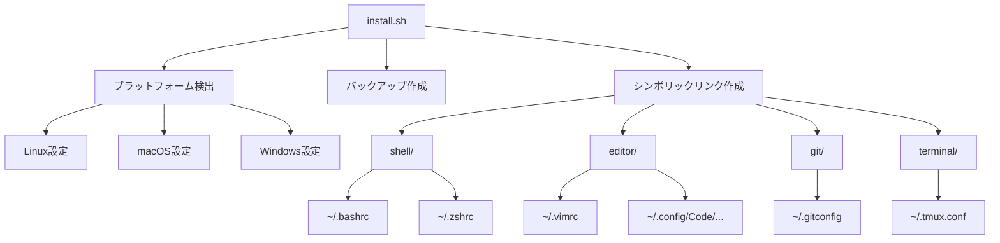

# システムパターン: dotfiles

## アーキテクチャ概要

dotfilesリポジトリは、以下の主要コンポーネントで構成されています：

```
dotfiles/
├── bin/                  # ユーティリティスクリプト
├── shell/                # シェル設定
├── editor/               # エディタ設定
├── git/                  # Git設定
├── terminal/             # ターミナル設定
├── os/                   # OS固有の設定
├── install.sh            # メインインストールスクリプト
└── README.md             # ドキュメント
```

## 主要な技術的決定

### 1. モジュール式構造

**パターン**: 設定を機能別のディレクトリに分割し、関連するファイルをグループ化します。

**理由**:
- 関連する設定を論理的にグループ化することで、ファイルの検索と管理が容易になります
- 新しい設定カテゴリを追加する際の拡張性が向上します
- 特定のカテゴリの設定のみをインストールするオプションを提供できます

**実装**:
- 各ディレクトリには関連する設定ファイルとそのディレクトリ固有のREADME.mdを含めます
- ディレクトリ名は設定の種類を明確に示すものにします

### 2. シンボリックリンク管理

**パターン**: リポジトリ内のファイルへのシンボリックリンクをホームディレクトリに作成します。

**理由**:
- リポジトリ内のファイルを直接編集でき、変更が即座に反映されます
- Gitによるバージョン管理が容易になります
- 設定の同期が自動的に行われます

**実装**:
- インストールスクリプトがシンボリックリンクを作成します
- 既存のファイルはバックアップされます
- 特定のアプリケーションがシンボリックリンクを適切に処理できない場合は、代替手段（コピーなど）を提供します

### 3. プラットフォーム検出と条件付き設定

**パターン**: OSを検出し、プラットフォーム固有の設定を適用します。

**理由**:
- 異なるOSでは異なる設定が必要な場合があります
- 同じ設定ファイルでも、OSによって場所や形式が異なる場合があります
- 特定のツールはプラットフォーム固有である場合があります

**実装**:
- インストールスクリプトでOSを検出します
- 共通の設定をベースとし、プラットフォーム固有のオーバーライドを適用します
- 条件付きインクルードを使用して、シェル設定内でプラットフォーム固有の設定を読み込みます

### 4. ドット付きファイル命名規則

**パターン**: リポジトリ内ではドットなしでファイルを保存し、インストール時にドット付きにリンクします。

**理由**:
- ドット付きファイルは多くのシステムで隠しファイルとして扱われ、リポジトリ内での可視性が低下します
- ファイル名の一貫性が向上します
- ファイルの目的が明確になります

**実装**:
- 例: リポジトリ内の `bashrc` は `~/.bashrc` にリンクされます
- インストールスクリプトがこの変換を処理します

## コンポーネント関係



## 設定の分離パターン

### 共通設定と特殊設定の分離

**パターン**: 設定を共通部分と特殊部分（マシン固有、OS固有など）に分離します。

**実装**:
- メインの設定ファイルは共通設定を含みます
- 特殊設定は別のファイルに保存され、条件付きでインクルードされます
- 例: `.bashrc` は共通設定を含み、`.bashrc.local` はマシン固有の設定を含みます

```bash
# .bashrc の末尾
if [ -f "$HOME/.bashrc.local" ]; then
    source "$HOME/.bashrc.local"
fi
```

### 機能別の分離

**パターン**: 大きな設定ファイルを機能別の小さなファイルに分割します。

**実装**:
- 設定ディレクトリ内に機能別のサブディレクトリを作成します
- メインの設定ファイルがこれらのファイルをインクルードします
- 例: `shell/bash/aliases.sh`, `shell/bash/functions.sh`, `shell/bash/prompt.sh` など

```bash
# .bashrc 内
for file in "$DOTFILES_DIR/shell/bash/"*.sh; do
    [ -r "$file" ] && source "$file"
done
```

## 拡張ポイント

### ローカルオーバーライド

ユーザーがリポジトリを変更せずに設定をカスタマイズできるようにします：

- 各設定ファイルは `.local` サフィックスを持つファイルをチェックし、存在する場合はそれをインクルードします
- これらのローカルファイルはGitで追跡されません（.gitignoreに追加）

### プラグインシステム

特定のツール（Vim、Zshなど）のプラグインを管理するためのパターン：

- プラグインマネージャーを使用して外部プラグインをインストールおよび更新します
- プラグイン設定を別のファイルに保存し、メイン設定ファイルからインクルードします

### テーマとスタイル

視覚的な設定（色、フォントなど）を分離して管理します：

- テーマ関連の設定を別のファイルに保存します
- 複数のテーマオプションを提供し、簡単に切り替えられるようにします
